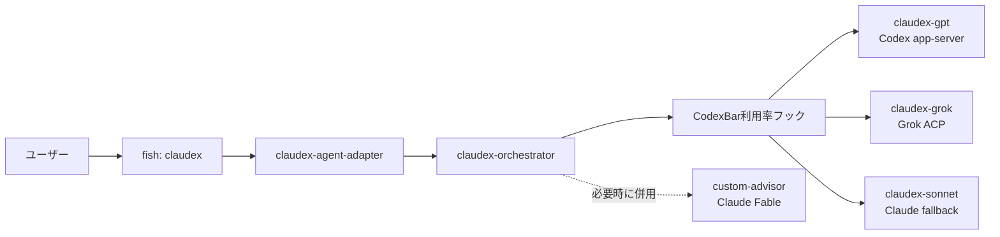

# Claudex

Claudex は Claude Code を操作画面とオーケストレーターとして使いながら、Codex、Grok
Build、Claude の各モデルへ仕事を振り分けるローカル実行環境です。provider の利用率、
モデル、実行方式、fallback、advisor は
[`providers.json`](./providers.json) で一元管理します。

このREADMEは日常利用と別のMacへの導入手順を扱います。Anthropic Messages API互換
adapterの内部実装や開発上の詳細は
[`tools/claudex-agent-adapter/README.md`](../../tools/claudex-agent-adapter/README.md)
を参照してください。

## 現在の構成



現在の既定値は次のとおりです。

| 役割 | Agent | Model | Effort | 選択条件 |
| --- | --- | --- | --- | --- |
| Orchestrator | `claudex-orchestrator` | Claude Code設定 (`sonnet`) | Claude Code設定 (`xhigh`) | 引数なしの通常起動 |
| Codex worker | `claudex-gpt` | `gpt-5.6-sol` | `high` | Codexに空きがある場合 |
| Grok worker | `claudex-grok` | `grok-4.5` | `high` | Grokに空きがある場合 |
| Fallback | `claudex-sonnet` | `sonnet` | `high` | 利用率を管理するproviderをすべて利用できない場合 |
| Advisor | `custom-advisor` | `claude-fable-5` | `xhigh` | 明示指定時、または複雑・曖昧・高リスクな判断時 |

provider worker のAgent定義は `model: inherit` です。実際のモデルはAgentファイルへ
重複定義せず、`providers.json` とAgent呼び出し時の `claudex_model` で決定します。
これにより、Claude Codeによるネイティブモデル検証を回避しながら、追加されたモデルを
設定だけで選択できます。

## ルーティング

1. 引数なしの `claudex` はClaude Code設定のモデルとeffortを継承して
   `claudex-orchestrator` を起動します。`mainProvider` はadapterのbootstrap routeと
   worker設定に使われ、通常起動のouter sessionへは強制しません。
2. prompt送信時に `codexbar usage --json` を実行し、providerごとの最大利用率だけを
   抽出します。結果は既定で5分間キャッシュされます。
3. 利用率が100%未満のproviderを `selected_workers` として選びます。
4. promptに `gpt...` または `grok...` の完全なモデルIDがある場合は、
   `modelPrefixes` が一致するproviderへそのIDをそのまま渡します。
5. providerを利用できない場合はClaude subscriptionのfallbackを使います。
6. advisorはworkerの代替ではありません。実装workerと独立して、必要な場合に併用します。

Codex/Grokの生の利用状況、アカウント情報、認証情報はキャッシュしません。
`~/.cache/claudex/usage-routing.json` にはルーティングに必要な利用率と選択結果だけを
モード `0600` で保存します。

## 別のMacへの導入

### 1. 前提ソフトウェア

macOS 14以降を前提とします。先にHomebrewと次のコマンドを用意してください。

```sh
xcode-select -p >/dev/null || xcode-select --install
brew install fish rustup python uv jq
brew install --cask claude-code codex codexbar
```

- Claude Codeは[公式Quickstart](https://code.claude.com/docs/en/quickstart)に従って
  `claude` を起動し、ログインします。
- Codex CLIは[公式README](https://github.com/openai/codex#quickstart)に従って
  `codex` を起動し、ChatGPTまたはAPI keyでログインします。
- CodexBarを一度起動し、Settings → ProvidersでCodexとGrokを有効にします。
  詳細は[CodexBar README](https://github.com/steipete/CodexBar#install)を参照してください。
  `codexbar` コマンドが見つからない場合は、同READMEのCLI tarballまたはCLI install手順も
  実行してください。
- Grok Build CLIは利用可能な配布元からインストールし、`grok login` を実行します。
  このadapterは `grok --model MODEL agent stdio` のACP接続を使用します。

インストールと認証を確認します。

```sh
fish --version
claude --version
codex --version
grok --version
codexbar usage --json | jq '[.[] | {provider, has_usage: (.usage != null)}]'
```

CodexBarの出力に `codex` と `grok` が含まれ、それぞれ `has_usage: true` になることを
確認してください。片方だけ使う場合は、後述の設定で不要なproviderを無効化できます。

### 2. dotfilesとClaude Code定義を配置

```sh
git clone git@github.com:kkkaoru/dotfiles.git
cd dotfiles
./create-symlinks.sh
```

`create-symlinks.sh` はClaude Codeの履歴やruntimeディレクトリを上書きせず、管理対象の
Agent、Skill、Command、Hook、settingsだけを `~/.claude` へリンクします。また、
次のClaudex関連ファイルもリンクします。

- `~/.config/claudex` → `.config/claudex`
- `~/.config/fish/functions/claudex.fish` → repositoryのfish function
- `~/.claude/agents/claudex-*.md` と `custom-advisor.md`
- `~/.claude/skills/claudex-routing`
- `~/.claude/CLAUDE.md`（共通のSubAgent・orchestration方針）
- `~/.claude/settings.json`

既存の通常ファイルやディレクトリと競合した場合、スクリプトは上書きせず `skip` を表示
します。内容を確認して退避または統合したあと、もう一度実行してください。

### 3. Rust adapterをビルドしてインストール

Homebrew版rustupの初回だけtoolchainを初期化し、新しいshellを開きます。

```sh
rustup-init
rustup toolchain install stable --component clippy,rustfmt
```

repository rootからrelease buildをインストールします。

```sh
cargo install --locked \
  --path tools/claudex-agent-adapter \
  --root "$HOME/.local" \
  --bin claudex-agent-adapter
```

`~/.local/bin` が `PATH` に含まれることを確認してください。このdotfilesのfish設定では
自動的に追加されます。

```sh
command -v claudex-agent-adapter
claudex-agent-adapter build-id
```

### 4. 設定とdaemonを確認

```sh
jq empty "$HOME/.config/claudex/providers.json"

claudex-agent-adapter ensure \
  --provider-config "$HOME/.config/claudex/providers.json"

curl --fail --silent http://127.0.0.1:8318/health | jq .
```

`status` が `ok` で、`backend_routes` にCodexとGrokが含まれていれば準備完了です。
常設のlaunchd plistは不要です。`claudex` の起動時に互換性のあるdaemonを再利用し、
存在しなければloopbackの `127.0.0.1:8318` へ自動起動します。

## 使い方

### 通常起動

任意のrepositoryへ移動して実行します。

```fish
cd /path/to/project
claudex
```

引数なしの場合だけ `--agent claudex-orchestrator` が自動追加されます。
通常起動ではadapterの `--inherit-claude-model` を使うため、outer sessionは
`~/.claude/settings.json` の `model` と `effortLevel` を継承します。

### Orchestratorのモデルを指定

```fish
CLAUDEX_MODEL=grok-4.5 claudex
CLAUDEX_MODEL=gpt-5.6-sol claudex
```

`CLAUDEX_MODEL` を明示した場合だけClaude Code設定の継承を無効化し、指定モデルをouter
sessionにも使います。指定値は `modelPrefixes` と照合され、設定にないprefixのモデルは
起動時に拒否されます。

### 作業workerのモデルをpromptで指定

```text
gpt-5.6-sol のworkerを使ってこの変更を実装してください。
```

Orchestratorは完全なモデルIDを `claudex_model` としてAgentへ渡し、一致するbackendを
遅延起動します。設定済みprefix内であれば、`defaultModel` 以外も同じ方式で選択できます。

### Advisorを併用

```text
custom-advisorを併用して設計をレビューし、workerの実装結果と統合してください。
```

Advisorは `custom-advisor / claude-fable-5 / xhigh` で独立して起動し、実装は行わず
意思決定、リスク、検証観点を返します。

### 非対話実行

引数を渡す場合はClaude Codeの引数をそのまま転送するため、Agentも明示します。

```fish
claudex --agent claudex-orchestrator --print \
  'custom-advisorを併用して、この設計をレビューしてください。'
```

### 一時的な設定上書き

```fish
CLAUDEX_PROVIDER_CONFIG=/path/to/providers.json claudex
CLAUDEX_USAGE_CACHE_SECONDS=0 claudex
CLAUDEX_SUBSCRIPTION_MAX_PROCESSES=8 claudex
CLAUDEX_SUBSCRIPTION_TIMEOUT_MINUTES=60 claudex
CLAUDEX_ADAPTER_LISTEN=127.0.0.1:9418 claudex
```

`CLAUDEX_USAGE_CACHE_SECONDS=0` は調査時だけ使用してください。通常はprovider CLIへの
不要な問い合わせを避けるため、既定の5分キャッシュを推奨します。

## providerやACPの追加

### 既存providerのモデルを変更

`providers.json` の `defaultModel` を変更します。同じproviderで将来追加されるモデルを
動的に受け入れる場合は `modelPrefixes` を維持または追加します。

worker Agentのfrontmatterは `model: inherit` のままにしてください。モデルをAgentへ
固定するとClaude Codeのネイティブ検証がadapterより先に実行され、providerモデルへ
到達できない場合があります。

### providerを無効化

```json
{
  "id": "grok",
  "enabled": false
}
```

実際のobjectでは他の必須フィールドを残し、`enabled` だけを `false` にします。

### 汎用ACPを追加

Rustコードを変更せず、`configured-acp` providerを追加できます。

```json
{
  "id": "vendor",
  "agent": "claudex-vendor",
  "defaultModel": "vendor-model-1",
  "effort": "high",
  "enabled": true,
  "modelPrefixes": ["vendor-"],
  "backend": "configured-acp",
  "acp": {
    "program": "vendor-cli",
    "arguments": ["--model", "{model}", "agent", "stdio"]
  }
}
```

`arguments` はshellを介さず直接実行され、すべての `{model}` が選択モデルに置換されます。
`agent` と同名の `~/.claude/agents/claudex-vendor.md` も作成し、frontmatterを
`model: inherit` にします。利用率をCodexBarで管理するproviderには `usageProvider` を
追加します。省略したproviderは常に利用可能なunmetered providerとして扱われます。

## 更新

別のMacでdotfilesを更新した場合は、リンクを再確認してadapterを再インストールします。

```sh
git pull --ff-only
./create-symlinks.sh
cargo install --locked --force \
  --path tools/claudex-agent-adapter \
  --root "$HOME/.local" \
  --bin claudex-agent-adapter
```

次回の `claudex` 起動時に、protocol、route、process limitが一致しない古いdaemonは
自動的に置き換えられます。

## 開発時の検証

### Rust adapter

```sh
cd tools/claudex-agent-adapter
cargo fmt-check
cargo lint
cargo test-all
cargo coverage
```

通常coverageは全体のline、function、regionと、各production fileのlineを95%以上に
保ちます。branch coverageにはnightlyと `cargo-llvm-cov` が必要です。

```sh
rustup toolchain install nightly --component llvm-tools-preview
cargo install cargo-llvm-cov --locked
cargo coverage-branch
```

### Routing hook

```sh
cd .claude/skills/claudex-routing
uv run tests/run_coverage.py
python3 scripts/route_usage.py --no-cache \
  | jq -e '.hookSpecificOutput.hookEventName == "UserPromptSubmit"'
```

Routing hookのstatement coverageとbranch coverageは、どちらも95%以上を必須とします。

## トラブルシューティング

### `provider config is not readable`

```sh
ls -ld "$HOME/.config/claudex"
ls -l "$HOME/.config/claudex/providers.json"
./create-symlinks.sh
```

### AgentまたはSkillが見つからない

```sh
ls -l "$HOME/.claude/agents/claudex-orchestrator.md"
ls -ld "$HOME/.claude/skills/claudex-routing"
./create-symlinks.sh
```

Claudexをdotfiles repository以外から使うには、AgentとSkillがproject-localではなく
`~/.claude` にリンクされている必要があります。

### providerがfallbackになる

```sh
codexbar usage --json | jq '[.[] | {provider, usage}]'
env CLAUDEX_USAGE_CACHE_SECONDS=0 \
  python3 "$HOME/.claude/skills/claudex-routing/scripts/route_usage.py" \
  | jq .
```

providerが存在しない、利用率が不明、いずれかのquota windowが100%、またはCodexBarが
失敗した場合は安全側に倒してfallbackを選びます。

### daemon設定が古い

```sh
claudex-agent-adapter ensure \
  --provider-config "$HOME/.config/claudex/providers.json"
curl --fail --silent http://127.0.0.1:8318/health | jq .
```

外部のlaunchd jobなどが旧 `--backend-route` 引数で同じportをKeepAliveしていると、共有
設定のdaemonを置き換えてしまいます。その場合は該当jobを停止し、`--provider-config`
参照へ更新してください。
