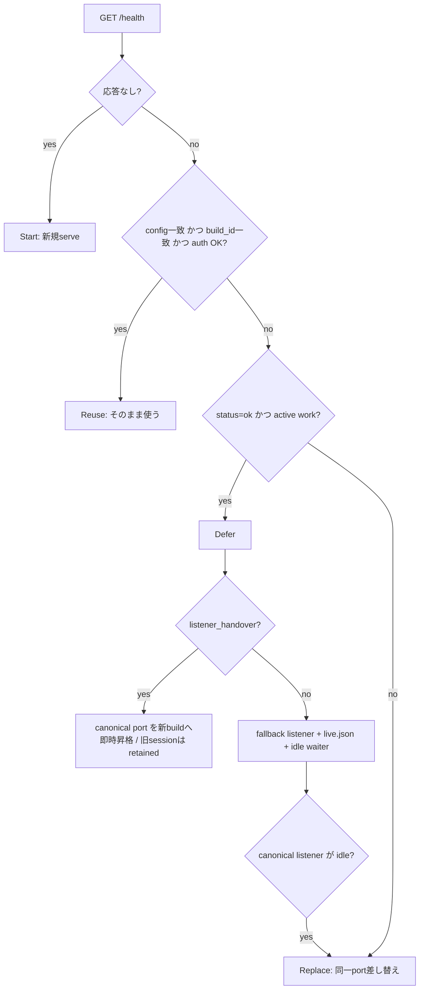

# Claudex

Claudex は Claude Code を操作画面とオーケストレーターとして使いながら、Codex、Grok
Build、Qwen Code、OpenCode Go、Claude の各モデルへ仕事を振り分けるローカル実行環境です。provider の利用率、
モデル、実行方式、fallback は
[`providers.json`](./providers.json) で一元管理します。
advisor は2系統を独立して併用します。Claude Code標準の引数なし `advisor()` は
[`settings.json`](../../.claude/settings.json) の `advisorModel` を使い、
custom-advisor SubAgent（`claude-opus-5` / `medium`）は worker capacity とは別管理の
論理的な session singleton として `SendMessage` で再利用します（hard process=1 ではない）。

このREADMEは日常利用と別のMacへの導入手順を扱います。Anthropic Messages API互換
adapterの内部実装や開発上の詳細は
[`tools/claudex-agent-adapter/README.md`](../../tools/claudex-agent-adapter/README.md)
を参照してください。

## 現在の構成

```mermaid
flowchart LR
    User[ユーザー] --> Fish[fish: claudex]
    Fish --> Adapter[claudex-agent-adapter]
    Adapter --> Orchestrator[Claude Code main session\nrequest model/effort]
    Orchestrator --> Hook[provider利用状況フック]
    Hook --> Codex[claudex-gpt\ngpt-5.6-luna\nCodex app-server]
    Hook --> CodexSpark[claudex-gpt-spark\ngpt-5.3-codex-spark\nCodex app-server]
    Hook --> Grok[claudex-grok\nGrok ACP]
    Hook --> Qwen[claudex-qwen\nQwen Code ACP]
    Hook --> Cursor[claudex-cursor\nCursor ACP]
    Hook --> ClineDs[claudex-cline-deepseek-flash\nClinePass ACP]
    Hook --> CommandCode[claudex-command-code-muse-spark-1-2-contributor\ncmd -p Muse Spark Contributor]
    Hook --> Sonnet[claudex-sonnet\nclaude-sonnet-5]
    Hook --> Fallback[claudex-sonnet\nClaude fallback]
    Orchestrator -. 標準機能 .-> BuiltinAdvisor[Claude Code advisor()\nadvisorModel: opus]
    Orchestrator -. 必要時に併用 .-> CustomAdvisor[custom-advisor\nclaude-opus-5 / medium]
```

現在の既定値は次のとおりです。

| 役割 | Agent | Model | Effort | 選択条件 |
| --- | --- | --- | --- | --- |
| Orchestrator | 通常のmain session | requestの実model（既定は `opus`） | requestのeffort（既定は `medium`） | Claude Code requestをそのまま使う。Claudeまたは設定済みexternal provider |
| Codex worker | `claudex-gpt` | `gpt-5.6-luna` | `max` | Codexに空きがある場合 |
| Codex Spark worker | `claudex-gpt-spark` | `gpt-5.3-codex-spark` | `xhigh` | CodexBar `codex` の `extraRateWindows` `codex-spark-weekly` 残量（通常の Codex weekly とは別）。枯渇時は選択されない |
| Fugu worker | `claudex-fugu` | `fugu` | `high` | CodexBarのSakana枠に空きがある場合 |
| Ollama GLM worker | `claudex-ollama-glm-5-2` | `glm-5.2:cloud` | `max` | CodexBarのOllama枠に空きがある場合 |
| Grok worker | `claudex-grok` | `grok-4.5` | `high` | Grokに空きがある場合 |
| Qwen worker | `claudex-qwen` | `qwen3.8-max-preview` | `high` | CodexBarの `qwencloud` 枠に空きがあり、モデル同時実行数の上限内の場合 |
| DeepSeek Pro worker | `claudex-deepseek-pro` | `opencode-go/deepseek-v4-pro` | `max` | CodexBarのOpenCode Go枠に空きがある場合。Flashとは別agent/model |
| DeepSeek Flash worker | `claudex-deepseek-flash` | `opencode-go/deepseek-v4-flash` | `max` | CodexBarのOpenCode Go枠に空きがあり、denylistに無い場合（このマシンでは無効化維持） |
| OpenCode GPT Luna worker | `claudex-opencode-gpt` | `opencode-go/gpt-5.6-luna` | `max` | CodexBarのOpenCode Go枠に空きがある場合。Codexの `gpt-5.6-luna` / `claudex-gpt` とは別route |
| Cursor worker | `claudex-cursor` | `auto` | `high` | CodexBarのCursor枠に空きがある場合。`cursor-agent --model auto --yolo acp`。modelはCLI+session/newで固定し、毎turnの `set_session_model` 再選択はしない |
| Cline DeepSeek Flash worker | `claudex-cline-deepseek-flash` | `cline-pass/deepseek-v4-flash` | `xhigh` | ClinePass枠（CodexBar `clinepass` weekly left）。`--thinking xhigh`。OpenCode Go DeepSeekとは別 |
| Command Code Muse Spark Contributor worker | `claudex-command-code-muse-spark-1-2-contributor` | `meta/muse-spark-1.2-contributor` | `high` | 自動 `selected_workers` 候補。CodexBar `commandcode` の weekly / 5h left で順位付け。agent slug に Muse Spark 1.2 と contributor を含める（将来の Command Code 他モデルと区別）。公式 `cmd -p` を `command-code-acp` が ACP 化し、既存 `configured-acp` で起動。Provider API / Meta 直接APIは使わない |
| Sonnet worker | `claudex-sonnet` | `claude-sonnet-5` | `high` | CodexBarのClaude枠（`usageProvider: claude`）残量。`claudex-haiku-search` と同じClaude usage leftを参照。outerがSonnet 5のときは同一modelの自動選択を抑制（明示起動と `CLAUDEX_ALLOW_SONNET_SUBAGENT=1` は可） |
| Fallback | `claudex-sonnet` | `claude-sonnet-5` | `high` | 自動worker選択で利用可能なcapacity-managed providerがない場合 |
| Built-in advisor | Claude Code標準 `advisor()` | `opus` | Claude Code標準 | 標準advisor policyに従う。provider capacity非依存 |
| Custom advisor | `custom-advisor` | `claude-opus-5` | `medium` | 明示指定時、または複雑・曖昧・高リスク・長期・停滞時。worker capacityとは別管理の論理 session singleton（hard process=1ではない） |

worker のAgent定義と `providers.json` の `subagentModel` に同じ固定モデルを指定します。
`defaultModel` は設定済みprovider routeの代表modelで、`subagentModel` 省略時はworkerにも
使われます。`selectableModels` は `/v1/models`（Claude Code `/model`）へ出す追加main候補で、
自動worker選択には入りません。main sessionではClaude Code requestの実modelがauthoritativeであり、
`defaultModel` や `mainProviders` が別modelへ書き換えることはありません。adapterはworker
呼び出し時の `claudex_model` を最終的なprovider routeとして扱い、テストでfrontmatterと
共有設定の不一致を検出します。

Codex app-server用のcustom provider credentialは、daemon起動時の非空envを最優先します。
コピー対象の `model_providers` が宣言する `env_key` だけを対象に、欠落時は
`~/.codex/.env`、`~/.env` の順で補完します。無関係なdotenv変数やcredential値は
log・healthへ出力しません。credential変更後は、永続app-server childへ新しい起動環境を
渡すため共有daemonを再起動します。

Qwen ACPは `/usr/bin/env` 経由でQwen Codeだけに
`QWEN_WEB_FETCH_PROCESSING_TIMEOUT_MS=15000` を渡し、`--approval-mode yolo` でmain sessionの
無確認実行と同等のtool権限にします。Qwen Codeの `web_fetch` は取得後の
content processingを既定で最大300秒待つため、ここでは15秒でraw contentへfallbackさせます。
workerにも1 batch 1件・1 task 2件までの取得上限と同一URLの再試行禁止を指定し、複数URLの
逐次処理によってSubAgentが長時間応答しない状態を抑えます。

全SubAgent定義は `tools`、`disallowedTools`、`permissionMode` を省略し、main sessionの全toolと
permission contextを継承します。調査・reviewという役割だけを理由に読み取り専用へ変更しません。
background SubAgentはClaude Codeの仕様上、main sessionで対話確認できる未承認操作を自動拒否
するため、その可能性がある作業はforegroundで委譲します。main sessionを
`--dangerously-skip-permissions` で起動した場合、そのmodeはSubAgentにも優先して継承されます。
Grok ACPの `grok-4.5` / `high` routeは
`grok --model grok-4.5 --reasoning-effort high agent --always-approve stdio` として起動します。
このnative Grok routeでは、adapterが解決してlogへ出すobservable effortも常に設定済みlaunch
effortの `high` です。適用されないrequest-level effortをturn固有値として表示しません。
`configured-acp` のOpenCodeはこの正規化の対象外で、従来どおりACP session configでeffortを
設定します。
Qwen ACPは `--approval-mode yolo` を明示し、provider自身の
approval待機やauto classifierがSubAgentの権限を狭めないようにします。OpenCode Go ACPは
`opencode acp` を起動し、モデルは adapter の `session/new` meta `modelId` で渡します
（CLIの `--model` は `acp` サブコマンドでは受け付けません）。DeepSeek Pro workerは
`claudex-deepseek-pro` / `opencode-go/deepseek-v4-pro`、Flash workerは
`claudex-deepseek-flash` / `opencode-go/deepseek-v4-flash` で区別します（prefixも各ID）。
GPT Luna workerは `opencode-go/gpt-5.6-luna`（effort `max`）で、Codex app-serverの
`gpt-5.6-luna` とmodel ID prefixで区別します。Flashはdenylistで無効化できます。
OpenCode内で実行されるprovider-owned toolはClaude側で再実行しないようAnthropic
`tool_use`へ変換せず、実行中だけthinkingの進捗として扱います。
このためClaude Codeの完了結果ではtool数が0に見える場合がありますが、OpenCode側では実行済みです。
全SubAgent streamはprovider sessionの準備開始時にmodel/effort付きの状態を直ちに表示し、
以後はprovider-owned tool/planの開始・完了と30秒ごとのactivity heartbeatを表示します。
これらの一時statusは最終回答と保存transcriptから除去されます。
DeepSeek / OpenCode GPT Luna workerは独立した調査をまとめて実行し、確定済みの判断を反復せず、
長い処理のフェーズ間で短い進捗を返すよう定義しています。
Cursor ACPは `cursor-agent --model {model} --yolo acp` を起動し、既定modelは `auto` です。
`--yolo` はCursor CLIの `--force` 別名で、main sessionの無確認実行と同等のtool権限にします。
Command Code Muse Sparkは `command-code-acp --model {model} --effort {effort}` を起動し、
内部で公式 headless `cmd -p --output-format json --yolo --trust --skip-onboarding --no-skills --no-session` を回します。SubAgent は常に one-shot（`--resume` しない）で、Claudex の ACP_NATIVE / routing dump / 再構成 transcript も `cmd` に載せません。
`--effort` は ACP/TUI 表示用だけで、Muse Spark は reasoning effort を受け付けないため `cmd` には渡しません。
`webSearchMode` は `acp-native`（Claude の巨大 system/routing を `cmd -p` に載せない）。
agent 定義から skills を外し、`SubagentStart` hook も Command Code だけ短文 reminder にする。
進捗（▶/✓ と `text_delta` thinking）は既存 ACP `ToolCall` / thought chunk 経由で SubAgent TUI に出ます。
`command-code-acp` は Muse Spark の文字単位 NDJSON をまとめて流す。ツール進捗は Cursor/Qwen/Grok/Cline と同じ ACP `ToolCall` 経路（`▶ name: query/path/url` → `✓`/`✗`、無音時は `… still working · last:`）。固定文（`ツール結果待ち` / `続きの調査または回答` / `次: …`）は出さない。ネイティブ `text_delta` は live text。`api_retry` / `tool_queued` / CoT thinking は親 TUI に流さない。
`cmd -p` stdout はバイト読み + lossy/繰り越し UTF-8 で消費し、Web 調査中の不正バイトや途中切断を ACP Internal error（`read cmd -p stdout`）にしない。
`mainProviders` と自動 `selected_workers` の両方に入ります。CodexBar provider 名は
`commandcode`（`usageProvider: "commandcode"`）です。
Cline ACPは `cline --auto-approve true --thinking {effort} -P <provider> -m {model} --acp` を起動します。
DeepSeek V4 Flashは provider `cline-pass` / model `cline-pass/deepseek-v4-flash` です（本機の
`~/.cline/data/settings/providers.json` で確認したID）。reasoning effortはCline CLIの
`--thinking`（`none|low|medium|high|xhigh`）へ渡し、ACPの `session/set_config_option`
`effort` は使いません。`{model}` / `{effort}` をCLIへ渡すためlaunch-scopedとして扱い、
毎turnの `set_session_model` 再選択はしません。Qwen は Qwen Cloud の `claudex-qwen`
（`qwen3.8-max-preview`）を使います。
daemonのPATHでは `~/.local/bin` をHomebrewより先に置き、壊れたHomebrew
`cursor-agent` shimを避けます。

## ルーティング

1. main sessionはClaude Code requestに入った実modelをそのまま使います。native Claude modelは
   Claude subscriptionへ、設定済みexternal modelは一致するprovider routeへ送ります。
   `mainProviders` はlegacy launcher / worker compatibilityのために残す設定で、main modelの選択、
   `gpt-5.6-luna` などへのhidden bootstrap、またはrequest modelのremapには使いません。
   claudex実行時だけglobal hookでworker向けorchestration contextを追加します。
2. prompt送信時にCodex/Grok/Sakana/Ollama/OpenCode Go/Claude/Qwen Cloudは
   `codexbar usage --json` を使います。Ollamaの
   usage取得に失敗した場合はlocal Ollama APIのmodel catalogを確認し、対象modelが存在すれば
   残量不明の候補として維持します。routing結果
   全体は既定で5分間キャッシュされます。共有daemonの `/health` にあるmodel別
   `model_concurrency` はpromptごとに再取得し、usage cacheには保存しません。health URLは
   `CLAUDEX_DAEMON_HEALTH_URL`、loopback `ANTHROPIC_BASE_URL` のorigin、
   `~/.cache/claudex/live.<port>.json` の現行世代、既定の
   `http://127.0.0.1:8318/health` の順に解決します。
   ClaudeのOAuthは `scripts/ensure-claude-oauth.sh` で定期的に同期・更新し、
   CodexBarのClaude sourceは一時的なOAuth失敗に備えて `auto` を推奨します。
3. 各providerをquota残量が多い順に並べます。`five-hour` windowを取得できるproviderは
   `min(seven-day|集約残量, five-hour)` を、five-hourが無いproviderは `seven-day`（または集約
   使用率の残量）を使います。OpenCode Goのmodel別request budgetと
   model別並列上限の余裕も同じ比較に加わり、残量0%（`requestBudget` の5時間窓を使い切ったmodelを
   含む）のproviderは
   そのturnの候補から外します。`maxConcurrency` に達したmodelも候補から外します。healthを
   取得できない場合はproviderを起動可能な候補として残し、
   adapter側のhard limitに最終判定を委ねます。片方のusage sourceが失敗しても別providerは
   無効化しません。
4. mainまたはworkerがAgent/Taskを起動するたび、そのturnへ注入された
   `selected_workers` からAgentを選び、model/effortを明示します。nested起動でもgeneric
   `claude`へのdefaultや親providerの無条件継承は行いません。親のmain modelと同じmodelが
   `selected_workers` に明示されている場合は、outer requestとは独立したSubAgentとして起動します。
   ただし、outer main modelがknownで `sonnet[1m]` / `claude-sonnet-5` の場合は、同じSonnet
   worker（`claudex-sonnet`）を自動選択せず利用量を節約します。`CLAUDEX_MAIN_MODEL_KNOWN=0` のresume/continueでは
   推測したmodel equalityによるこの抑制を行いません。明示的な
   `claudex_model: claude-sonnet-5` は引き続き起動でき、自動選択を明示的に許可する場合だけ
   `CLAUDEX_ALLOW_SONNET_SUBAGENT=1` を指定します。
5. promptに `gpt...`、`fugu...`、`glm-...`、`grok...` または `qwen...` の完全なモデルIDがある場合は、
   `modelPrefixes` が一致するproviderへそのIDをそのまま渡します。ただし、専用設定と
   端末固有の追加設定を統合したdeny listに含まれる完全一致モデルは明示指定でも拒否します。
6. 自動worker選択で利用可能なcapacity-managed providerがない場合はClaude subscriptionの
   fallback（`claudex-sonnet`）を使います。`claudex-sonnet` は通常のClaude枠候補としても
   `nativeWorkers` に入り、空きがあれば他workerと並んで選ばれます。ただしouter sessionが
   Sonnet 5のときは同一modelの自動選択から除外します（明示起動は除外しません）。一方、main
   requestまたは明示的なworker requestが設定済みprovider modelを指定し、そのproviderを起動できない場合は
   エラーを返し、Claudeや別providerへ黙って切り替えません。
7. advisorはworkerの代替ではありません。Claude Code標準の `advisor()` はprovider quotaと
   独立して会話履歴全体を自動参照します。`custom-advisor` もworker capacity /
   `selected_workers` スロットとは別管理で、実装を行わず戦略レビューとpeer `SendMessage`
   に使います。両者は置換関係ではなく併用可能です。

### WebSearchの経路

WebSearchは、選択されたmodelのprovider routeにある `webSearchMode` で経路を決めます。
model IDやeffortはここへハードコードせず、各providerの `defaultModel`、`subagentModel`、
`effort`（またはリクエストの明示値）をそのまま使います。

| `webSearchMode` | 実行経路 | 回答を作るmodel |
| --- | --- | --- |
| `codex-native` | Codex app-serverのnative live WebSearch | 選択されたCodex route |
| `acp-native` | ACP providerが提供するnative検索 | 選択されたACP route |
| `delegate-ccr` | adapterのCCR互換 `worker/web-search` が `webSearch.fallbackProviders` の順に検索workerを起動 | 元のmodel（検索結果だけを返却） |
| `delegate-mcp` | 設定済みACP/MCP providerの検索機能 | 選択されたprovider |
| `disabled` | 検索を公開しない | 元のmodel（検索なし） |

`delegate-ccr` は、検索を要求したmodelがnative検索を持たない場合の既定経路です。
`fallbackProviders` はprovider IDの順序で、各workerの実model/effortを使って検索します。
したがって、たとえば `grok` から検索しても、結果取得だけを `codex-spark` → `codex`
へ委譲し、最終回答はGrokのセッションへ戻ります。検索workerが全て失敗した場合は
空の成功を返さずエラーにし、Claude Code側で再試行可能な形にします。

### Web research evidence contract

The final answer must keep discovery and verification distinct. `search_result_only` means that a
URL or claim came from a native WebSearch title, URL, or snippet. It is useful for choosing a page
to inspect, but it is not a citation for a material fact. `fetch_verified` means the provider
completed WebFetch (or an equivalent provider fetch) and returned the cited page content; only this
class may support a factual claim such as a person's role, a date, an amount, or a quotation.

ACP providers can execute provider-owned native WebSearch/WebFetch without emitting executable
Claude Code `tool_use` or `tool_result` records. Consequently, `tool_uses: 0` in a Claude
transcript is a Claude-side observation, not proof that no provider-native search or fetch took
place. Check the provider's provenance before making that claim. The converse is also important:
native search activity alone does not make every result URL `fetch_verified`.

For provider-native completions, the adapter also exposes an aggregate,
non-executable audit field in the Anthropic response: `metadata.claudex.web_evidence`
contains `verified_count` and `evidence_class_counts.verified_retrieval`. It never
contains provider URLs, page text, or model-authored prose. This metadata explains
why a Claude transcript can show `tool_uses: 0` while the selected ACP provider
still supplied validated retrieval evidence; it is an audit signal, not a substitute
for the provider's source-level evidence contract.

When a requested fact needs verification and no `fetch_verified` evidence is available, retry a
permitted fetch or route retrieval to a verified-capable worker. If that cannot succeed, report the
fact or URL as unavailable with the reason. Do not cite an unverified URL or complete the answer
from memory.

`claudex` の1 invocationだけ、CCR互換ルート用にsession IDとaccess tokenをadapterへ渡します。
Claude subscriptionの子プロセスではこれらのlocal CCR変数を除去するため、検索要求が
誤って同じadapterへ再帰することはありません。設定検証は起動時に行い、未定義・無効化された
fallback providerは受け付けません。

生response、アカウント情報、Cookie、API keyはキャッシュしません。
`~/.cache/claudex/usage-routing.json` にはrouting結果を5分間保存します（モード `0600`）。
Qwen Cloudを含むCodexBar枠の残量は `codexbar usage --json` から都度取得し、別途の
`qwen-quota.json` / `tmp/curl.txt` 経路は使いません。

### SubAgentとcustom-advisorの再利用

必要な並列性、役割分離、独立レビューのためのworker SubAgentを固定上限で抑制せず、作業に
必要な数を起動します。一方、1つの作業が終わっただけでは同じinstanceを自動的に破棄せず、
関連する追作業が見込まれ、agent、model、effort、scopeが互換なら、Agent/Task結果が指定した
正確な `SendMessage` recipient（通常agent ID、named mailbox teammateではteammate名）へ継続
します。追送は、そのrecipientが未確認の新しい証拠を含む、必要最小限で自己完結した差分にし、
会話contextとprompt prefixを再利用します。

`custom-advisor` は論理的なsession singletonとして同じ方針で再利用します。最初に起動した
互換instanceを関連判断の継続advisorとし、完了後も含めて `SendMessage` で再開します。
これはOS process数のhard cap（process=1）ではなく、session内の再利用方針です。worker
capacityとは別勘定であり、`selected_workers` の空きを消費しません。真の並列レビュー、
clean-room review、role/model/contextの非互換、recipient不可用の場合だけ別instanceを起動
します。workerやpeerは、作業方針を変えうる戦略的助言が必要なときに同じadvisorへ
`SendMessage` できます。

独立した第二意見、clean-room review、真の並列実行、route/model/effortや権限範囲の変更では
新しいworker instanceを起動します。終了時は、追作業とcache再利用の可能性に対して、
slot・resource圧力、contextの陳腐化や混入、役割の完了度を比較します。recipientは現在の
main session内だけで扱い、推測・memoryへの永続化・TaskListによる再探索は行いません。

adapter daemon/backendの再利用とSubAgent会話instanceの再利用は別の層です。adapter側の
provider threadは通常2時間保持し、capacity到達時は最古のidle sessionを先に解放します。
完了済みagentを無意味に稼働させ続けるのではなく、logical recipientを保持して必要時に
resumeします。Claude subscriptionを使うcustom-advisorは継続時も内部process自体は毎回新規
になり得ますが、同じlogical transcriptを渡すため再利用可能なprompt prefixを保てます。
実際のprompt cache hitはprovider依存であり保証されません。

## 別のMacへの導入

### 1. 前提ソフトウェア

macOS 14以降を前提とします。先にHomebrewと次のコマンドを用意してください。

```sh
xcode-select -p >/dev/null || xcode-select --install
brew install fish rustup python uv jq
brew install --cask claude-code codex codexbar
```

- Claude Codeは[公式Quickstart](https://code.claude.com/docs/en/quickstart)に従って
  `claude` を起動し、ログインします。
- Codex CLIは[公式README](https://github.com/openai/codex#quickstart)に従って
  `codex` を起動し、ChatGPTまたはAPI keyでログインします。
- CodexBarを一度起動し、Settings → ProvidersでCodexとGrokを有効にします。
  詳細は[CodexBar README](https://github.com/steipete/CodexBar#install)を参照してください。
  `codexbar` コマンドが見つからない場合は、同READMEのCLI tarballまたはCLI install手順も
  実行してください。
- Grok Build CLIは利用可能な配布元からインストールし、`grok login` を実行します。
  このadapterの `grok-4.5` / `high` routeは
  `grok --model grok-4.5 --reasoning-effort high agent --always-approve stdio` のACP接続を使用します。
  GrokはClaude互換hookのstdinを閉じないため、adapterはchildに `CLAUDEX_GROK_ACP=1` を渡し、
  `SessionStart` のClaude専用Herdr通知を入力読取前にskipします。これにより各sessionの10秒timeoutと
  timeout後に残るhook processを防ぎます。
- Qwen Codeは `bun add -g @qwen-code/qwen-code` など公式手順でインストールし、`qwen` の
  `/auth` からToken Planを設定します。API keyはclaudexへ重複設定せず、Qwen Code自身の
  設定を `qwen --acp --approval-mode yolo --model MODEL` が再利用します。残量はCodexBarの
  `qwencloud` provider（`usageProvider: "qwencloud"`）から取得します。

インストールと認証を確認します。

```sh
fish --version
claude --version
codex --version
grok --version
qwen --version
codexbar usage --json | jq '[.[] | {provider, has_usage: (.usage != null)}]'
claudex-route-usage --no-cache | jq .
```

CodexBarの出力に `codex`、`grok`、`qwencloud` などが含まれ、それぞれ `has_usage: true`
になることを確認してください。片方だけ使う場合は、後述の設定で不要なproviderを無効化できます。

### 2. dotfilesとClaude Code定義を配置

```sh
git clone git@github.com:kkkaoru/dotfiles.git
cd dotfiles
./create-symlinks.sh
```

`create-symlinks.sh` はClaude Codeの履歴やruntimeディレクトリを上書きせず、管理対象の
Agent、Skill、Command、Hook、settingsだけを `~/.claude` へリンクします。また、
次のClaudex関連ファイルもリンクします。

- `~/.config/claudex` → `.config/claudex`
- `~/.config/fish/functions/claudex.fish` → repositoryのfish function
- `~/.claude/agents/` 配下の全定義
- `~/.claude/skills/claudex-routing`
- `~/.claude/CLAUDE.md`（共通のSubAgent・orchestration方針）
- `~/.claude/settings.json`

既存の通常ファイルやディレクトリと競合した場合、スクリプトは上書きせず `skip` を表示
します。内容を確認して退避または統合したあと、もう一度実行してください。

### 3. Rust adapterをビルドしてインストール

Homebrew版rustupの初回だけtoolchainを初期化し、新しいshellを開きます。

```sh
rustup-init
rustup toolchain install stable --component clippy,rustfmt
```

repository rootからrelease buildをインストールします。正本は `~/.cargo/bin` です。
`./create-symlinks.sh` が `~/.local/bin/claudex-agent-adapter` をそのsymlinkにし、
zsh向けの `claudex-hot-swap` もリンクします。

```sh
tools/claudex-agent-adapter/scripts/cargo-ephemeral.sh +1.97.1 install \
  --path tools/claudex-agent-adapter \
  --root "$HOME/.cargo" \
  --bin claudex-agent-adapter \
  --bin command-code-acp
# または cargo install --locked --path tools/claudex-agent-adapter \
#   --bin claudex-agent-adapter --bin command-code-acp
./create-symlinks.sh
```

`~/.local/bin` が `PATH` に含まれることを確認してください。このdotfilesのfish設定では
自動的に追加されます。zshから `claudex-hot-swap` を使う場合も同じです。

```sh
command -v claudex-agent-adapter
command -v claudex-hot-swap
claudex-agent-adapter build-id
```

### 4. 設定とdaemonを確認

```sh
jq empty "$HOME/.config/claudex/providers.json"

claudex-agent-adapter ensure \
  --provider-config "$HOME/.config/claudex/providers.json"

curl --fail --silent http://127.0.0.1:8318/health | jq .
```

`status` が `ok` で、`backend_routes` にCodex、Grok、Qwen、OpenCode Goが含まれ、上限を設定したmodelが
`model_concurrency` に `active`、`queued`、`limit`、`available` を持てば準備完了です。
常設のlaunchd plistは不要です。`claudex` / `ensure` は互換なdaemonを再利用し、
idleならTUI付きでも同じportへ新buildを差し替え、無ければloopbackの `127.0.0.1:8318`
へ起動します。差し替えの判定と `claudex-hot-swap` は
[daemonの差し替え（hot-swap）](#daemonの差し替えhot-swap仕様)を参照してください。

## 使い方

### 通常起動

任意のrepositoryへ移動して実行します。

```fish
cd /path/to/project
claudex
```

通常起動では `--agent` を追加せず、`CLAUDEX_ACTIVE` が設定されたプロセスでのみglobal
`UserPromptSubmit` hookがrouting contextを注入します。このため新規・resumeのどちらでも
sessionの表示名をagent名へ変更しません。加えて `prepare-claude-config.py` が
claudex 専用の隔離 `settings.json` にだけ `PreToolUse` / `PostToolUse` /
`SubagentStop`（Rust バイナリ `~/.cargo/bin/claudex-tool-policy`、crate は
`tools/claudex-tool-policy`）を注入し、routed worker がある
あいだ main session の Read/Write/Edit/検索ツールを拒否し、SubAgent 同士の同一
ファイル Write/Edit を排他ロックします（Bash は main でも許可）。これらの拒否は
`agent_id` / `agent_type` / subagent transcript で判定し **SubAgent には引き継がれません**。
UserPromptSubmit では main 向け、SubagentStart では worker 向けの tool policy 文言を
それぞれ注入します。共有の
`~/.claude/settings.json` には入れないため、素の `claude` にはこの機械的制限は付きません。
緊急時のみ `CLAUDEX_ALLOW_MAIN_TOOLS=1` で main の file/search 直接実行を許可できます。
自動 `selected_workers` は weekly 残量が十分ある peer がいるとき、weekly 残量が低い
（目安 25% 未満）worker と、残量不明な worker（例: Ollama の API 到達のみ）を除外します。
adapter も同じ 25% / 40% 目安を `usage-routing.json` から読み、明示的な
`claudex-gpt-spark` 起動や SubAgent HTTP を sibling provider へ書き換えます。
残量が少ない Spark を繰り返し起動しません。Ollama が CodexBar 未計測でも API 到達可能な場合は、
他に実測メーター付き peer が無いときだけ自動候補に残ります。
過去に `--agent claudex-orchestrator` が付いた
transcriptをresumeする場合、adapterは残存する `agent-setting` を検知し、slug / 既存title /
cwd名から `--name` を復元して表示名の固定化を解除します。明示的な `--name` や `--agent`
はそのまま優先されます。adapterの `--inherit-claude-model` を使うため、outer sessionは
`~/.claude/settings.json` の `model` と `effortLevel` を継承します。
launcherは起動元のcwdを予約済みcustom headerでloopback adapterへ渡すため、daemonや
provider設定がdotfilesにあってもCodex、Grok、Qwen、Sonnetの作業ディレクトリは実行元を維持します。
既存の `ANTHROPIC_CUSTOM_HEADERS` は保持され、予約済みheaderだけが安全な値へ置き換わります。

### SubAgentの並列制御

`claudex` はClaude Codeのmain sessionへ次の環境変数をexportして、通常のSubAgentの
並列方針を一元化します。値は起動ごとに環境変数で上書きでき、`MAX_PARALLEL` は上限であって
常にその数を起動する指定ではありません。

| 環境変数 | 既定値 | 役割 |
| --- | ---: | --- |
| `CLAUDEX_SUBAGENT_MAX_PARALLEL` | `40` | 利用可能なworker slotに対する上限。実際の起動数は `min(独立scope数, 利用可能slot数, 上限)` で毎タスク決定 |
| `CLAUDEX_SUBAGENT_MIN_PARALLEL` | `3` | 分解可能な multi-scope フェーズで目指す preferred scope 数（hook の `minimum_subagents_per_phase`）。不可分な1 scope を水増ししない |
| `CLAUDEX_SUBAGENT_ACTIVE_FLOOR` | `2` | multi-scope 実行中に維持したい active worker の下限目安（`minimum_active_subagents`） |
| `CLAUDEX_SUBAGENT_MIN_MODEL_FAMILIES` | `2` | multi-scope 時に望ましい model family 多様性の下限（`minimum_model_kinds`） |
| `CLAUDEX_SUBAGENT_REEVALUATE_ON_COMPLETION` | `1` | workerの完了・失敗・timeoutごとに残作業、追指示、追加launchを再判定 |
| `CLAUDEX_SUBAGENT_REASSESS_INTERVAL_SECONDS` | `600` | 10分ごとのactive set・capacity・model familyの再評価間隔 |
| `CLAUDEX_SUBAGENT_REUSE` | `1` | model・scopeが互換な worker を Agent/Task の `resume=<agentId>` で再利用・復活。Agent Teams だけ `SendMessage` |
| `CLAUDEX_SUBAGENT_CLEANUP_ON_EXIT` | `1` | main session終了・cancel・error時にlaunch停止、childのcancel/wait/reapを要求 |
| `CLAUDEX_SUBAGENT_FIRST` | `1` | routed workerがある場合はSubAgent委譲を必須化し、main直接実行をfallback限定にする |
| `CLAUDEX_ALLOW_MAIN_TOOLS` | unset | `1` のときだけ PreToolUse の main 実行拒否を解除（緊急回避） |
| `CLAUDEX_SUBAGENT_STATUS_POLL_SECONDS` | `15` | background SubAgentの`TaskList`/非ブロッキング`TaskOutput`状態スナップショット間隔 |
| `CLAUDEX_MODEL_CONCURRENCY_WAIT_TIMEOUT_MS` | `30000` | 同一modelのadmission待機を有限化し、期限超過時は明示的なエラーを返す |

設定例:

```fish
# 通常workerを最大12件まで。実際の起動数はタスクの独立scope数で決まる
CLAUDEX_SUBAGENT_MAX_PARALLEL=12 \
claudex
```

独立scopeが1件ならworkerは1本だけ起動し、空きslotがあっても増やしません（`task_fanout_default` /
`single_scope_fanout` は常にこの1 scope ケースの例です）。scopeが2件なら最大2本、scopeが5件でも
利用可能slotと上限を超えて起動しません。routing hook は `task_fanout_examples` と
`multi_scope_example_fanout` で multi-scope 時の fan-out を明示し、常に1本だけと誤解されないようにします。
分解可能な multi-scope フェーズでは `MIN_PARALLEL` / `ACTIVE_FLOOR` / `MIN_MODEL_FAMILIES` を
preferred target として使い、不可分な単一scopeを水増ししてまで満たしません。各scopeに安定したキーを
付け、実行中・完了・中断済みのキーを再起動しません。worker完了後に空きslotを自動補充することもせず、
未処理で新しいキーを持つscopeが既に分解済みの場合だけ起動します。これはcustom-advisorには適用せず、
custom-advisorは独立した論理session singletonとして必要時に再利用します。

#### RAM圧力に応じた動的なSubAgent管理

routing hookは各呼び出しでmacOSのメモリ状況（free + inactive + speculativeページの合計を
`hw.memsize` で割った利用可能率）を1回だけサンプリングし、`orchestration` の
`max_parallel_workers` を動的に引き下げます。RAMが枯渇してmacOSがアプリケーションを終了させる
事態を防ぐため、上限は縮める方向にしか作用せず、`reuse_compatible_workers` はhigh/critical
圧力下で強制的に有効化されます（再利用を促して新規起動を減らす）。

| 利用可能率（既定） | 圧力レベル | 動的上限 |
| ---: | --- | ---: |
| 10%未満 | critical | 2 |
| 10–20% | high | 6 |
| 20–30% | medium | 16 |
| 30–40% | moderate | 32 |
| 40%以上 | ok | 制限なし |

| 環境変数 | 既定値 | 役割 |
| --- | ---: | --- |
| `CLAUDEX_MEMORY_MANAGEMENT` | `1` | `0`/`false`/`off` でメモリ管理を無効化 |
| `CLAUDEX_MEMORY_AVAILABLE_PCT_CRITICAL` | `10` | critical閾値（%）。昇順であること |
| `CLAUDEX_MEMORY_AVAILABLE_PCT_LOW` | `20` | high閾値（%） |
| `CLAUDEX_MEMORY_AVAILABLE_PCT_MEDIUM` | `30` | medium閾値（%） |
| `CLAUDEX_MEMORY_AVAILABLE_PCT_MODERATE` | `40` | moderate閾値（%） |

hook出力の `orchestration.memory_management` に `status`、`pressure_level`、`available_percent`、
`configured_max_parallel_workers`、`effective_max_parallel_workers`、`management_active`、
`reuse_required` が入ります。プローブ失敗時は `status: unavailable` となり、メモリチェックで
routingを止めません。このスナップショットは5分キャッシュとは独立で、毎回の実測です。

#### codexbar使用量による動的なmodel選択

`selected_workers` はquota残量が多い順で並びます。`five-hour` windowを取得できるproviderは
`min(seven-day|集約残量, five-hour)` を使い、five-hourが無いproviderは `seven-day`（または集約
使用率の残量）を使います（model別concurrencyの余裕も同じ比較に加わります）。
hook出力の `worker_capacity` リストはこの優先順を
保持し、各workerの `used_percent` / `remaining_percent` / `weekly_remaining_percent` /
`five_hour_remaining_percent` を公開するため、subagentで起動する
modelの選択が実行時に動的に決まっていることが確認できます。残量0%のproviderは候補から除外され、
unknown meter（Ollama API到達のみ）は `null` のまま ample peer がいると自動候補から落ちます。
`usageProvider` を省略した provider だけが unmetered になります。Command Code は
CodexBar `commandcode` を参照します。

`claudex_model` を指定せずに起動するSubAgent（特にClaude Code組み込みの `general-purpose` type）は、
本来このランキングを素通りしてadapterへ `native_model=None` で到達し、recoverableなrouteを持ちません。
hook出力の `default_subagent_route` はトップランクのworker（`selected_workers[0]`、選択残量が最も多い
model）を明示するため、こうした起動も除外されず動的な勝者へ解決されます。`agent` / `model` / `effort` に
加えて `applies_to_subagent_types: ["general-purpose"]` と `applies_when_claudex_model_omitted: true` を
持ち、選択可能なworkerが1つも無い場合のみ `null` になります。
adapterはAgent/Task境界で `subagent_type` / `claudex_model` / `claudex_effort` を同じ
`selected_workers` entryの不可分なtupleへ正規化し、別workerのmodel/effortとの混在や
呼び出し側による内部routing markerの偽装を拒否します。明示model overrideも、最新の人間の
入力に含まれ、かつ指定agentと同じproviderの `model_prefixes` に一致する場合だけ維持されます。

#### subagentセッションへのrouting context注入

Claude Codeは `UserPromptSubmit` の `additionalContext` をmain sessionにしか注入しないため、
`claudex-route-usage` は `SubagentStart` hook（`--event SubagentStart`）でも同じバイナリを実行します。
`SubagentStart` の `additionalContext` はsubagentの会話開始前にそのセッションへ入るため、
各routed workerは自分のネストしたAgent/Task起動用に同じsanitized context
（`selected_workers`、`disabled_subagent_models`、メモリ方針、`worker_capacity`）を読み込めます。
例外: `claudex-command-code-muse-spark-1-2-contributor`（および将来の `claudex-command-code-*`）は Muse Spark に巨大 routing/skill dump を載せないため、
短文 reminder だけを注入し usage collect もスキップします。
使用量は5分キャッシュを使うためspawnごとの追加コストは小さく、denylistはadapterがAPI境界で
常に強制します（workerが見える見えないに関わらず）。

minimumやmodel familyを満たせない場合は、provider quota、denylist、model別concurrency、または
ユーザーの明示的な単一worker指定という具体的な理由をrouting summaryへ残します。制限を黙って
破って同じmodelの直列実行へフォールバックしません。

### outer model/effort の既定値を切り替える

`claudex` と素の `claude` の既定 model は分離しています。

| 用途 | 設定場所 | 備考 |
| --- | --- | --- |
| 素の `claude` | `~/.claude/settings.json` の `model` / `effortLevel` | native Claude model のみ |
| `claudex` | `~/.config/claudex/defaults.$(hostname -s).local.json` または `defaults.local.json`（Git 管理外） | external provider 可。省略時は settings 継承 |
| `claudex` 実行時の Claude Code 設定 | `CLAUDE_CONFIG_DIR=~/.config/claudex/claude-config` | `/model` の永続化もここ。共有 `~/.claude` へは書かない |

起動時に `prepare-claude-config.py` が agents / sessions / history / hooks などを
`~/.claude` から symlink し、isolated な `settings.json` だけを claudex 用 model/effort で
上書きします。共有 settings に残っている `claude-claudex-…` は起動時に
`sonnet[1m]` へ戻して、素の `claude` が壊れた model id を拾わないようにします。

`claudex` の outer session は、既定では settings 継承モードで `$HOME/.claude/settings.json` の
`model` と `effortLevel` を使います（isolated tree へ seed）。その値から Claude Code request に
入った実 model/effort が routing の authority です。model は native Claude でも設定済み
external provider でもよく、`mainProviders` や provider の `defaultModel` を使って hidden
`gpt-5.6-luna` bootstrap へ置き換えません。

`--resume` / `--continue` で `CLAUDEX_MODEL` を明示していない場合、launcherは
`CLAUDEX_MAIN_MODEL_KNOWN=0` を渡します。再開sessionのmain modelは新しいrequestの実modelだけを
authorityとし、現在または過去のsettings modelをfallbackとして推測しません。main modelとの
equalityを前提にしたworker抑制も行いません。`CLAUDEX_MODEL` を明示した場合だけ、その指定modelを
knownなmain modelとして同じmodelの抑制判断に利用できます。

頻繁に切り替える値は、Git 管理外の端末別ファイルに保存します。

- 優先: `~/.config/claudex/defaults.$(hostname -s).local.json`
- 次点: `~/.config/claudex/defaults.local.json`
- 雛形: `~/.config/claudex/defaults.example.json`
- Git 除外: `.config/claudex/.gitignore`

このファイルは JSON 以外の内容を実行しません。ファイルがある場合の `source` 省略時は
`explicit` です（`model` / `effort` がそのまま outer session に効く）。

```json
{
  "version": 1,
  "source": "explicit",
  "model": "opus",
  "effort": "medium"
}
```

`source: "settings"` では共有の `~/.claude/settings.json` を土台にしつつ、同じローカル
ファイルの `model` / `effort` があれば端末ごとに上書きします。片方だけ書いても構いません。

```json
{
  "version": 1,
  "source": "settings",
  "model": "opus",
  "effort": "medium"
}
```

```fish
cp ~/.config/claudex/defaults.example.json \
  ~/.config/claudex/defaults.(hostname -s).local.json
# 必要なら model / effort を編集してから
claudex
```

`explicit` ではローカルの `model` / `effort` を outer session に渡し、`settings` では共有
settings を読んでからローカル上書きを適用し、`--inherit-claude-model` で起動します（isolated
`CLAUDE_CONFIG_DIR` へ seed）。設定ファイルの `source` が不正、JSON が壊れている、または
settings に必要な値がない場合は、別のモデルへ黙って切り替えず `claudex` を終了します。
`CLAUDEX_DEFAULTS_SOURCE=explicit claudex` のような一時指定も可能です。既存の `CLAUDEX_MODEL`
は explicit mode を選び、`CLAUDEX_EFFORT` は model と独立して effort を上書きします。
`CLAUDEX_DEFAULTS_CONFIG` で別パスを直接指定することもできます。

SubAgentへの委譲はsubstantiveな調査・実装・レビューに対する既定動作なので、promptごとに
繰り返し指定する必要はありません。Claude Codeの `N queued` はmain conversationの次turnへ
渡す入力数であり、human promptとbackground Agentの完了通知を含みます。workerの実行slot数や
`SendMessage` の配信待ち数ではありません。独立workerを複数起動する場合、処理時間が不明または
重たい可能性がある作業は `run_in_background: true` のbackground batchとして同じturnで起動し、
1つのslow workerがmain turnや完了済みpeerを塞がないようにします。foregroundは、次のmain操作
前に結果が必須な短いbounded work、またはユーザーが同期完了を明示した場合だけ使います。全結果を
集めるだけのforeground batchは使いません。background起動後は具体的な独立作業を直ちに開始するか、
短いuser-visible statusを返してturnを終了します。完了通知が次turnへ入ったら、slowest workerを
待たず到着済み結果を逐次統合し、hidden reasoningで待機しません。既に委譲promptに含まれる制約の
再送は行わず、busy workerへの配信待ちは追加の並列数として数えません。
background workerはfire-and-forgetにしません。起動直後に`TaskList`と各taskへの非ブロッキング
`TaskOutput`を実行し、task id・worker・model・経過時間・最新statusをmain sessionへ表示します。
以後15秒ごと（`CLAUDEX_SUBAGENT_STATUS_POLL_SECONDS`で変更）と各user turn開始時に状態を再取得します。
`SubAgent is still processing in the background`の場合は再起動せず、現在のtask idと状態を表示したまま
独立した作業を継続します。

foreground batchではClaude Codeのmain turn自体が最後のworkerの完了まで占有されます。その間に
先に届いた `<agent-message>` が表示されても、mainが次の判断へ進めないため、`✶ Philosophising…`
が停止に見えることがあります。これは重いworkerの処理時間にmainを従属させていたことが原因です。
background batchなら完了済みpeerの通知を保持したままmain turnを解放し、遅いworkerの完了後に
残りの結果を統合できます。
Claude Code 2.1系の `N background agents launched` は複数の標準Agent tool cardをまとめた
headerです。直後の各identity行または `↓ to manage` から個別workerを確認できます。headerだけが
見える場合も、これを `N queued` や直列実行とは解釈しません。十分なterminal表示領域でidentity行が
継続して欠落する場合は、adapterではなくClaude Code TUI側の表示問題として切り分けます。

### Orchestratorのモデルを指定

```fish
CLAUDEX_MODEL=grok-4.5 claudex
CLAUDEX_MODEL=gpt-5.3-codex-spark claudex
CLAUDEX_MODEL=gpt-5.6-terra claudex
CLAUDEX_MODEL=qwen3.8-max-preview claudex
```

`gpt-5.6-terra` は Codex `codex` provider の main `/model` 候補（`selectableModels`）です。
自動 SubAgent は従来どおり `gpt-5.6-luna` / `claudex-gpt` です。Terra を outer にする場合は
`/model` で `claude-claudex-gpt-5.6-terra` を選ぶか、上記の `CLAUDEX_MODEL` を使います。
Claude Code は `gpt-5.6-terra` を未知モデルとして 200k compact 前提にするため、launcher は
provider の `maxContextTokens`（Codex は `110000`）を `CLAUDE_CODE_MAX_CONTEXT_TOKENS` へ渡します。

`CLAUDEX_MODEL` を明示した場合だけClaude Code設定の継承を無効化し、指定モデルをouter
sessionにも使います。指定値は `modelPrefixes` と照合され、設定にないprefixのモデルは
起動時に拒否されます。

### 作業workerのモデルをpromptで指定

```text
gpt-5.3-codex-spark のworkerを使ってこの変更を実装してください。
```

Orchestratorは完全なモデルIDを `claudex_model` としてAgentへ渡し、一致するbackendを
遅延起動します。nested Agent/Taskでも `selected_workers` の同一entryにあるagent/modelを
必ず明示し、model未指定時にparentやmain modelを暗黙継承しません。設定済みprefix内であれば、
active userが完全なmodel IDを指定した場合に限り `defaultModel` 以外も同じ方式で選択できます。
`selected_workers` にmainと同じmodelがある場合も、その明示指定を優先します。
Grok ACPがprovider内で起動するnativeなnested workはGrok session内に留まり、別providerの
workerへ暗黙転送しません。cross-provider workはmain orchestrationが `selected_workers` から
明示的に起動し、その結果をmain sessionへ戻して統合します。

### SubAgentモデルを禁止

provider設定とは分離した denylist で、常に禁止する完全一致モデルを定義します。共有の追跡
ファイルは空の baseline で、端末ごとの禁止リストは Git 管理外に置きます。

- 優先: `~/.config/claudex/disabled-subagent-models.$(hostname -s).local.json`
- 次点: `~/.config/claudex/disabled-subagent-models.local.json`
- 共有 baseline: `~/.config/claudex/disabled-subagent-models.json`（tracked、既定は空）
- 雛形: `~/.config/claudex/disabled-subagent-models.example.json`
- Git 除外: `.config/claudex/.gitignore`

```json
{
  "version": 1,
  "disabledModels": [
    "opencode-go/deepseek-v4-flash",
    "qwen3.8-max-preview"
  ]
}
```

```fish
cp ~/.config/claudex/disabled-subagent-models.example.json \
  ~/.config/claudex/disabled-subagent-models.(hostname -s).local.json
```

main sessionのモデルと標準advisorには影響しません。一時的に別ファイルや追加禁止を使う場合は
次のように指定します。

```fish
# この端末だけ別の専用ファイルを参照
set -gx CLAUDEX_DISABLED_SUBAGENT_MODELS_CONFIG /path/to/terminal-policy.json
claudex

# 専用ファイルに加えて、この端末だけ複数モデルを追加で禁止
set -gx CLAUDEX_DISABLED_SUBAGENT_MODELS gpt-5.6,grok-4.5
claudex

# 端末固有の上書きと追加を解除
set -e CLAUDEX_DISABLED_SUBAGENT_MODELS_CONFIG
set -e CLAUDEX_DISABLED_SUBAGENT_MODELS
```

`disabledModels` と追加環境変数は完全なモデルIDです。環境変数側はカンマ区切りです。
Claudex起動後に設定を変更しても既存sessionには反映されないため、変更後は新しい `claudex`
sessionを開始してください。routing hookは統合した禁止モデルを候補・fallback・再利用から
除外し、共有daemonも端末別request headerを使ってSubAgent provider実行直前に再検証します。
全モデルが禁止または利用不能ならmain sessionが作業を継続します。

### 端末別ポリシー: providers のローカル上書き

`qwen` をこの Mac だけ有効化し、他の Mac では無効化する場合は、`providers.json` を
デフォルトで `qwen` 無効にした状態で、端末ごとの上書きファイルを使います。

- 端末別上書きファイル: `~/.config/claudex/providers.$(hostname -s).local.json`
- Git 追跡対象から除外: `~/.config/claudex/.gitignore`
- 例: `~/.config/claudex/providers.kkk4oru.local.json`

```json
{
  "version": 1,
  "mainProviders": ["codex", "grok", "fugu", "ollama-glm-5-2", "qwen", "opencode-go"],
  "providers": [
    {
      "id": "qwen",
      "enabled": true
    }
  ]
}
```

上書きファイルが存在する場合のみ反映し、明示的に `CLAUDEX_PROVIDER_CONFIG` を設定した
場合はそちらを優先します。

`mainProviders` はlegacy launcher / worker compatibility用に維持します。この配列の先頭や
並び順がmain sessionのrequest modelを選択またはremapすることはありません。

```fish
set -gx CLAUDEX_PROVIDER_LOCAL_CONFIG "$HOME/.config/claudex/providers.$(hostname -s).local.json"
claudex
```

### 標準Advisorとcustom-advisorを利用

```text
標準advisorを使って設計をレビューし、workerの実装結果と統合してください。
```

```text
custom-advisorを併用して設計をレビューし、workerの実装結果と統合してください。
```

Claude Code標準の `advisor()` は引数を取らず、呼び出し時点の会話履歴全体を自動参照します。
`providers.json` ではmodel routingせず、`.claude/settings.json` の `advisorModel: opus` を
使用します。

`custom-advisor` はこれと独立したSubAgentで、`claude-opus-5` / `medium` を使い、実装はせず
意思決定・リスク・検証観点とpeer向けの簡潔な助言を返します。session内では最初の互換
instanceを継続利用し、worker capacityとは別管理です。無効化する場合は次を設定します。

```fish
# custom-advisor SubAgentのみ無効（標準advisor()は利用可能）
set -gx CLAUDEX_CUSTOM_ADVISOR 0
claudex
```

`CLAUDEX_CUSTOM_ADVISOR` が `0` / `false` / `off`（大文字小文字無視）のときだけ
custom-advisor起動をスキップします。未設定またはそれ以外の値では有効です。

### 非対話実行

引数はClaude Codeへそのまま転送され、routing hookは自動で有効になります。

```fish
claudex --print \
  '標準advisorを使って、この設計をレビューしてください。'
claudex --print \
  'custom-advisorを併用して、この設計をレビューしてください。'
```

### 一時的な設定上書き

```fish
CLAUDEX_PROVIDER_CONFIG=/path/to/providers.json claudex
CLAUDEX_DISABLED_SUBAGENT_MODELS_CONFIG=/path/to/disabled-models.json claudex
CLAUDEX_USAGE_CACHE_SECONDS=0 claudex
CLAUDEX_SUBSCRIPTION_MAX_PROCESSES=20 claudex
CLAUDEX_SUBSCRIPTION_TIMEOUT_MINUTES=120 claudex
CLAUDEX_ADAPTER_LISTEN=127.0.0.1:9418 claudex
CLAUDEX_DISABLED_SUBAGENT_MODELS=gpt-5.6,grok-4.5 claudex
CLAUDEX_CUSTOM_ADVISOR=0 claudex
CLAUDEX_DEFAULTS_SOURCE=settings claudex
CLAUDEX_EFFORT=high claudex
CLAUDEX_SUBAGENT_MAX_PARALLEL=20 claudex
CLAUDEX_SUBAGENT_REASSESS_INTERVAL_SECONDS=600 claudex
CLAUDEX_SUBAGENT_REEVALUATE_ON_COMPLETION=1 claudex
CLAUDEX_SUBAGENT_REUSE=1 claudex
CLAUDEX_SUBAGENT_CLEANUP_ON_EXIT=1 claudex
```

`claudex` は `CLAUDE_CODE_MAX_CONCURRENT_SUBAGENTS` と
`CLAUDE_CODE_MAX_SUBAGENTS_PER_SESSION=1024`、および上記のSubAgent policyを既定値でexportし、
外部から指定した値を優先します。通常の `claude` は `.claude/CLAUDE.md` の同じ方針を使いますが、
fish functionを経由しない場合は必要な環境変数をshell側で設定してください。`claudex` はadapter側の
`subscription-max-processes` を既定で20、`subscription-timeout-minutes` を120に揃えます。実行中のsessionには
反映されないため、上限変更後は新しいsessionを起動してください。

resume対象の履歴にClaude Code自身の `Subagent spawn limit reached (.. of ..)` が残っている場合、
`claudex` は履歴を保持したまま `--fork-session` を自動付与して新しいsession IDで継続します。
これにより古いsessionに保存された上限値を再利用せず、元のresume履歴も削除しません。通常のresumeは
そのまま同じsession IDを使います。自動forkを明示的に無効化する場合だけ
`CLAUDEX_AUTO_FORK_SPAWN_LIMIT_RESUME=0 claudex --resume <id>` を指定してください。

同じresume IDを複数の `claudex` プロセスで同時に開くことは禁止しています。launcherは明示的な
`--resume <id>`（`--fork-session` なし）に対してセッション単位の排他ロックを子プロセスの終了まで保持し、
二重起動を既存セッションを終了させずに明示的なエラーとして拒否します。別の作業枝を意図的に開く場合は
`claudex --resume <id> --fork-session` を使ってください。これにより同一transcriptの競合で片方のUIが
突然終了したように見える状態を防ぎます。

SubAgentの累積起動数はセッション単位で台帳化します。各起動の `agentId` / `agent_id`、モデル、
promptから抽出した作業scope、active/completed状態を紐付けて管理し、次の作業ではscopeが最も近い
recipientを動的に選びます。既存の `agentId` / `agent_id` は
`~/.cache/claudex/subagent-recipients-v1.json` に保存します。resumeやcompactで履歴が短くなった場合は
同じ宛先へ `Agent` / `Task` の `resume=<agentId>`（Agent Teams では `SendMessage`）で継続する指示を
復元します。同じscopeの新規起動は adapter が `resume` へ書き換え、台帳上の新規spawn数を増やしません。
失敗・cancel・stop した worker と独立scopeだけが新しい起動になります。通常の継続ターンではプロンプトの
固定部分を変更しないため、provider側のプロンプトキャッシュを維持します。1024件に到達した場合はClaude Codeの
`Agent` / `Task` 起動ツールを新たに公開せず、既存SubAgentへの連絡・結果取得・ユーザー対応を継続します。

`CLAUDEX_USAGE_CACHE_SECONDS=0` は調査時だけ使用してください。通常はprovider CLIへの
不要な問い合わせを避けるため、既定の5分キャッシュを推奨します。

## providerやACPの追加

### 既存providerのモデルを変更

provider routeの代表modelは `providers.json` の `defaultModel`、workerを別modelへ固定する
場合は `subagentModel` を変更します。同じproviderで `/model` に出したい追加main候補は
`selectableModels` に列挙します（例: Codex の `gpt-5.6-terra`）。これは広告専用で、新しい
SubAgent / worker は作りません。main sessionのmodelは `.claude/settings.json` または
`CLAUDEX_MODEL` からClaude Code requestへ入り、その実modelがauthoritativeです。同じproviderで
将来追加されるモデルを動的に受け入れる場合は `modelPrefixes` を維持または追加します。

`subagentModel`（省略時は `defaultModel`）、対応するworker frontmatter、呼び出し時の
`claudex_model` を同じ値へ更新してください。テストは共有設定とAgent定義の不一致を拒否します。

`maxContextTokens` は、requestの実modelがそのprovider routeを選択した場合だけ適用します。
providerが設定済みまたは `mainProviders` に含まれるだけでは、Claudeや別providerのrequestへ
その上限を適用しません。選択されたrouteで概算入力トークン数が上限に達した時点で新しいprovider
threadを先に開始し、`contextWindowExceeded` を事前回避します。未設定は現行どおり既定値なし
（制御なし）として扱われます。`gpt-5.3-codex-spark` は、
2026-07-26 の実運用ログで約116k入力トークン時に上限へ到達したため、再構築時の
システム指示やtool schemaの余白を確保して `110000` を採用しています。
`fugu` はCodex catalogの1M context windowに合わせて
`1000000` を指定しています。いずれもproviderが実際の上限を先に返した場合は、
非streaming turnを新規threadで1回だけ自動再試行します。

`maxConcurrency` はpositive integerのmodel別並列上限です。`subagentModel`（省略時は
`defaultModel`）だけでなく、同じproviderの `modelPrefixes` に一致して動的生成された各exact
model routeにも同じ値を継承します。共有daemonは `/health` の `model_concurrency` にexact model
ごとの `active`、`queued`、`limit`、`available` を公開し、routing hookはquota headroomと
予約済みqueueを含む空きslotの小さい方を使って候補を並べます。

OpenCode Goの利用枠は並列数ではなくrequest budgetとして別に扱います。`requestBudget` は
CodexBarの `opencodego` usageにある指定window（現在のPro設定は `primary`、300分）の
`usedPercent` を、OpenCode Goが公開するmodel別推定リクエスト数に換算します
（DeepSeek Proは5時間あたり推定3,450、Flashは31,650。DeepSeek workerの既定はPro）。
出力の `request_budget` には窓、リセット時刻、推定使用件数、推定残件数を含め、窓が欠落・不一致・
不明な場合は候補から除外します。これはOpenCode Goの使用量制御であり、DeepSeek APIのレート制限や
adapterの同時実行制御とは別です。根拠は[OpenCode Go公式の利用枠](https://dev.opencode.ai/docs/go/)
です。
healthが一時的に読めない場合も起動候補は維持されますが、
adapter自身が上限を強制するため超過実行は許可されません。

### providerを無効化

```json
{
  "id": "grok",
  "enabled": false
}
```

実際のobjectでは他の必須フィールドを残し、`enabled` だけを `false` にします。

### 汎用ACPを追加

Rustコードを変更せず、`configured-acp` providerを追加できます。

```json
{
  "id": "vendor",
  "agent": "claudex-vendor",
  "defaultModel": "vendor-model-1",
  "effort": "high",
  "enabled": true,
  "modelPrefixes": ["vendor-"],
  "backend": "configured-acp",
  "acp": {
    "program": "vendor-cli",
    "arguments": ["--model", "{model}", "agent", "stdio"]
  }
}
```

`arguments` はshellを介さず直接実行され、すべての `{model}` が選択モデルに置換されます。
`agent` と同名の `~/.claude/agents/claudex-vendor.md` も作成します。Claude Codeが外部model
IDを受理しないproviderではfrontmatterを `model: inherit` にし、呼び出し時の
`claudex_model` で固定します。利用率をCodexBarで管理するproviderには `usageProvider` を
追加します。必要ならmodel別上限としてpositive integerの `maxConcurrency` も追加します。
Qwen Cloud quotaを使うproviderは `usageProvider: "qwencloud"` とします（CodexBarの
provider名と一致）。省略したproviderは常に利用可能なunmetered providerとして扱われます。

## 更新

別のMacでdotfilesを更新した場合は、リンクを再確認してadapterを再インストールします。
daemonの差し替え仕様は次節を参照してください。手動で `:8318` を止めてから起動し直す必要はありません。

```sh
git pull --ff-only
./create-symlinks.sh
```

adapterの正本は `~/.cargo/bin/claudex-agent-adapter` です。`create-symlinks.sh` は
`~/.local/bin/claudex-agent-adapter` をそのsymlinkにし、`claudex-hot-swap` も
`~/.local/bin` へリンクします。fish / zsh の `claudex` と `claudex-hot-swap` は
`~/.local/bin` 経由でこの正本を呼びます。`--root "$HOME/.local"` だけに入れると、
symlink作成後に古いcargo binへ戻るため、install先はcargo bin（または両方）にしてください。

```sh
./scripts/claudex-install-adapter
# fishなら claudex install
# または tools/claudex-agent-adapter/scripts/cargo-ephemeral.sh +1.97.1 install \
#   --force --path tools/claudex-agent-adapter --root "$HOME/.cargo" \
#   --bin claudex-agent-adapter --bin command-code-acp
```

`cargo-ephemeral.sh … install` は成功後に `after-install.sh` を呼び、
`~/.local/bin` を relink して idle hot-swap waiter を新 `build_id` 向けに武装します
（`cargo install` は実行中 waiter の inode を置き換えて落とすため）。busy な `:8318`
はそのまま残り、idle 後に差し替わります。生の `cargo install` だけした場合は次節の
`claudex-hot-swap` を別途実行してください。

### daemonの差し替え（hot-swap）仕様

共有daemonは常設launchdではなく、`claudex` / `ensure` / `hot-swap` がport単位で
管理します。既定listenerは `127.0.0.1:8318`（`CLAUDEX_ADAPTER_LISTEN` で変更可）。
同一portのlauncherは `~/.cache/claudex` のlockで直列化します。

判定材料は `/health` です。`status`、`protocol_version`、`model`、route、
`service_config_fingerprint` / `codex_config_fingerprint`、subscription上限、
source由来の `build_id`、認証が揃い、かつ `build_id` が今動かしているバイナリと
一致すれば再利用します。一致しない場合でも、進行中のHTTP requestまたは
provider turnがあるlistenerは切りません。


```mermaid
flowchart TD
  Health["GET /health"] --> Absent{"応答なし?"}
  Absent -->|yes| Start[Start: 新規serve]
  Absent -->|no| Match{"config一致 かつ build_id一致 かつ auth OK?"}
  Match -->|yes| Reuse[Reuse: そのまま使う]
  Match -->|no| Busy{"status=ok かつ active work?"}
  Busy -->|yes| Defer[Defer]
  Busy -->|no| Replace["Replace: 同一port差し替え"]
  Defer --> Handover{"listener_handover?"}
  Handover -->|yes| Promote["canonical port を新buildへ即時昇格 / 旧sessionは retained"]
  Handover -->|no| Fallback["fallback listener + live.json + idle waiter"]
  Fallback --> IdleWait{"canonical listener が idle?"}
  IdleWait -->|yes| Replace
```

`active work` は `active_http_requests > 0`、`active_provider_turns > 0`、または
`active_subagent_models` の合計 > 0 です。idleな `launch` TUIが付いていても Replace します。
TUIプロセスはkillしません。`listener_handover: true` のdaemonは busy でも canonical port
を即時手放し、新buildが同じportで live になります。旧sessionは retained generation へ
sticky proxy されます。handover非対応の旧daemonでは fallback listener + idle waiter のまま
で、`~/.cache/claudex/live.<port>.json` が今使う世代を指します。起動中のstreamは切りません。

| 入口 | idle（TUI付き含む） | busy | 備考 |
| --- | --- | --- | --- |
| `claudex` / `claudex-agent-adapter launch` | 同一portをReplace | Defer → 新buildのfallback listener + idle waiter | 新しいClaude Code sessionだけfallbackへ。既存TUIは旧portのまま。waiterがidle後に本portを差し替える |
| `claudex-agent-adapter ensure` | 同一portをReplace | Defer → fallback + idle waiter | `claudex` と同じ。stdoutに使うbase URLを出す |
| `claudex hot-swap` / `claudex-hot-swap` / `claudex-agent-adapter hot-swap` | 同一portをReplace | Defer → fallback + idle waiter（drain待ちなし） | stdoutは今すぐ使うbase URL。既存作業は旧portのまま。waiterがidle後に本portを差し替える |

Replace時は旧serveへgraceful shutdown（SIGTERM、process groupやSIGKILLへは進めない）を送り、
listenerが空くまで待ちます。`launch` 親プロセスには信号を送りません。新daemonの
readinessに失敗し、旧世代のrecovery manifestがある場合は旧世代を戻します。

fallback listenerはloopbackの空きportに新buildを起動し、状態を
`~/.cache/claudex/fallback.<port>.json` に保存します。同じ世代なら再利用し、
daemonを増やし続けません。既存sessionの進行中streamは旧daemonに残ります。

日常の更新手順:

```sh
# 1. 新バイナリを入れ、idle waiter を新 build_id 向けに武装する
./scripts/claudex-install-adapter
# fishなら claudex install

# 2. 確認。idleなら :8318 の pid が変わり build_id が一致。
#    busyなら新 claudex / hot-swap stdout の fallback が新 build。:8318 は waiter 待ち
claudex-agent-adapter build-id
curl --fail --silent http://127.0.0.1:8318/health | jq '{pid, build_id, status}'
```

busy中に `claudex-hot-swap` すると、進行中のstreamは打たず、今すぐ新buildの
fallback listenerへルーティングし、`~/.cache/claudex/pending-hot-swap.<listen>.json`
に状態を書いて `hot-swap --wait-idle` waiterをdetachします。stdoutのURLが
新しいsessionの接続先です。waiterはport lockを持たずにidleを待ち、同じportへ
Replaceします。同じbuildのwaiterが生きていれば再spawnしません。ensure / launch /
hot-swap のDeferは同じfallback+waiterなので、作業中のclaudexとadapter回収を
同時に進められます。本portはidle後に自動で新buildになります。
新buildのwaiterを武装したときは macOS 通知「ビルド完了・待機中」、busy中に現行
世代fallbackが立ち上がったときは「live 更新完了」（listen・build・即時利用可）、
同じportへの Replaceが完了したときは「差し替え完了」を出します。Reuseや既に武装済み
のwaiter、同じ listen+build+種別の再武装では通知しません。待機のあとに live が
使え、さらに本portへ差し替わったときは最大3通です。

`providers.json` のrouteやQwen起動引数、subscription上限、Codex credentialも
fingerprintの対象です。credential変更後は永続app-server childへ新しい起動環境を
渡すため、同じ差し替え経路でdaemonを更新します。

## 開発時の検証

### Rust adapter

```sh
cd tools/claudex-agent-adapter
cargo fmt-check
cargo lint
cargo test-all
cargo coverage
```

通常coverageは全体のline、function、regionと、各production fileのlineを95%以上に
保ちます。branch coverageにはnightlyと `cargo-llvm-cov` が必要です。

```sh
rustup toolchain install nightly --component llvm-tools-preview
cargo install cargo-llvm-cov --locked
cargo coverage-branch
```

### Routing hook

```sh
cd tools/claudex-route-usage
cargo test
cargo build --release
claudex-route-usage --no-cache \
  | jq -e '.hookSpecificOutput.hookEventName == "UserPromptSubmit"'
```

Routing hook は Rust crate `tools/claudex-route-usage` です。変更後は `cargo test` と
`cargo install --path tools/claudex-route-usage` で `~/.cargo/bin/claudex-route-usage` を更新します。
メインの file/search 拒否と SubAgent ファイルロックは Rust crate
`tools/claudex-tool-policy` です。同様に `cargo test` と
`cargo install --path tools/claudex-tool-policy` で
`~/.cargo/bin/claudex-tool-policy` を更新します。

## トラブルシューティング

### `provider config is not readable`

```sh
ls -ld "$HOME/.config/claudex"
ls -l "$HOME/.config/claudex/providers.json"
./create-symlinks.sh
```

### AgentまたはSkillが見つからない

```sh
ls -l "$HOME/.claude/agents/claudex-orchestrator.md"
ls -ld "$HOME/.claude/skills/claudex-routing"
./create-symlinks.sh
```

Claudexをdotfiles repository以外から使うには、AgentとSkillがproject-localではなく
`~/.claude` にリンクされている必要があります。

### providerがfallbackになる

```sh
codexbar usage --json | jq '[.[] | {provider, usage}]'
env CLAUDEX_USAGE_CACHE_SECONDS=0 \
  claudex-route-usage \
  | jq .
```

providerが存在しない、quota windowが100%、またはusageを確認できない場合は、その
providerを自動worker候補から外します。全候補が利用不可の場合だけworker fallbackを選びます。
main requestの実modelが設定済みproviderを指定している場合、そのproviderが利用不可ならエラーにし、
fallbackや別providerへ黙って切り替えません。

### daemon設定が古い

仕様は[daemonの差し替え（hot-swap）](#daemonの差し替えhot-swap仕様)を参照してください。

```sh
claudex-agent-adapter build-id
claudex-hot-swap
# または idle なら ensure / 新しい claudex でも同一port差し替え
claudex-agent-adapter ensure \
  --provider-config "$HOME/.config/claudex/providers.json"
curl --fail --silent http://127.0.0.1:8318/health \
  | jq '{pid, build_id, status, active_http_requests, active_provider_turns}'
```

`/health.build_id` がinstallした `build-id` と一致しないときは、まだ旧daemonです。
busyなら `ensure` / `launch` / `hot-swap` はどれもfallbackへ逃がし、canonical portはidle waiterが後から差し替えます。
TUIをkillしてportを空ける必要はありません。

外部のlaunchd jobなどが旧 `--backend-route` 引数で同じportをKeepAliveしていると、共有
設定のdaemonを置き換えてしまいます。その場合は該当jobを停止し、`--provider-config`
参照へ更新してください。

### SubAgent結果の受け取りとpeerメッセージ

Claude Code標準のSubAgentは `Agent` / `Task` の起動結果に含まれる `task_id` を使い、
`TaskOutput` で結果を取得します。claudexもこの経路を既定にし、通常の worker の結果や進捗を
`SendMessage` へ送らないよう子プロンプトで指定します。`<agent-message>` と
`<task-notification>` は完了本文ではなくライフサイクル通知として扱い、正確な `task_id` の
`TaskOutput` を呼び出します。これにより、ユーザーが指定した Agent Teams や通知設定を
claudex が上書きしません。

Agent Teamsを使う場合も、結果の本文は `TaskOutput` を優先し、peer メッセージは制御用の
通信としてだけ使ってください。
